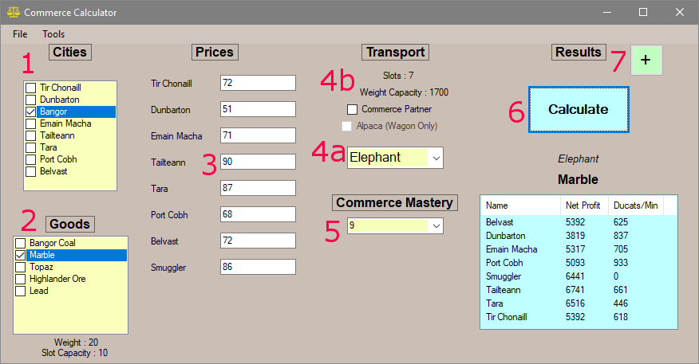

# Commerce Calculator Instructions and FAQ

## Table of Contents
1. [Step by Step Instructions](#step-by-step-instructions-toc)
2. [FAQ](#faq-toc)

## Step by Step Instructions [[TOC](#table-of-contents)]
	

1. Select a town that you are transporting goods from
2. Select a good that you wish to transport
3. Input the prices as you see them in the game
4. __A.__ Select the transport that you are using __B.__ (Optional) Indicate if you have a commerce partner or alpaca for their respective transports
5. (Optional) Select the Commerce Mastery Rank you have
6. Click Calculate to display results below
7. (Optional) Expand the window to incorporate a 2nd results listing for comparisons

## FAQ [[TOC](#table-of-contents)]
Will be updated as necessary

__1. Net Profit is some large positive/negative but the Ducats/Min shows exactly 0?__

This means that there is no detected route to that destination with the selected transport. Check in the time tracker that the destination has a connection to a city that does properly display ducats/min for the selected transport. By default, this should not be a problem.

It also because of this reason that the smuggler will remain at 0 Ducats/min. Since he does not stay at one place and moves around, he is not registered as a city when it comes to calculating time.

__2. I disagree with your time data/It could be done better__

You are free to modify the time data as you wish. There is a time tracker tool included that allows you to modify the time data at will. Also in the Launcher Settings window, you may select which file is being used for the time data, allowing community members to easily share data files at will.

__3. File Not Found?__

By default, the commerce calculator looks for the respective files in a folder labeled "Resources" in the same directory as the Mabi-Tools.exe. You may change the respective locations in the Settings Menu found on the launcher.
